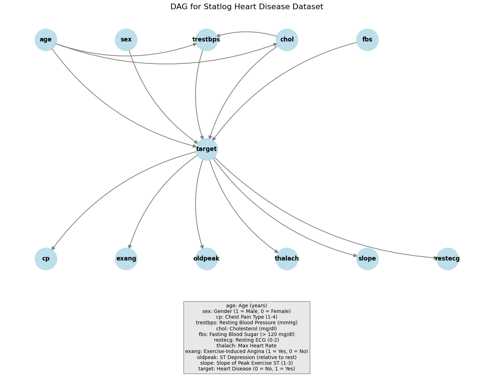

# CVD Counterfactual Analysis Pipeline

A reproducible pipeline for generating and validating counterfactual explanations for cardiovascular disease (CVD) risk prediction. The pipeline combines **DiCE-ML** counterfactual generation with **Structural Causal Model (SCM)** validation using **DoWhy**, and computes **95% confidence intervals** across 100 independent iterations.

## Research Context

Counterfactual explanations answer: *"What minimal changes to a patient's clinical profile would flip their CVD risk prediction from high-risk to low-risk?"*

This pipeline addresses a key challenge: counterfactual generators like DiCE produce statistically valid but not necessarily **causally plausible** explanations. We validate each counterfactual through an SCM that encodes cardiovascular domain knowledge, ensuring interventions on actionable features (cholesterol, blood pressure) propagate realistically to downstream clinical indicators.

## Pipeline Architecture

```
                        ┌─────────────────────┐
                        │   High-Risk Patient  │
                        │     (target = 1)     │
                        └──────────┬──────────┘
                                   │
                                   ▼
                        ┌─────────────────────┐
                        │   DiCE Generator     │
                        │  (Genetic Algorithm) │
                        │                      │
                        │  Proposes:           │
                        │   chol: 240 -> 160   │
                        │   trestbps: 160->110 │
                        └──────────┬──────────┘
                                   │
                    ┌──────────────▼──────────────┐
                    │    SCM Validation (DoWhy)    │
                    │  InvertibleStructuralCausal  │
                    │  Model (3-layer DAG):        │
                    │                              │
                    │  Risk Factors → Disease:     │
                    │  age,sex,chol,fbs,           │
                    │  trestbps ──> target         │
                    │                              │
                    │  Disease → Symptoms:         │
                    │  target ──> cp,restecg,      │
                    │  thalach,exang,slope,oldpeak  │
                    │                              │
                    │  do(chol), do(trestbps)      │
                    │  Propagate via interventional│
                    │  sampling with fixed seed    │
                    └──────────┬──────────────────┘
                               │
                    ┌──────────▼──────────┐
                    │  Target flipped?     │
                    │  (1 -> 0)            │
                    ├──────────┬──────────┤
                    │  YES     │    NO    │
                    │  Valid   │ Rejected │
                    └────┬─────┴──────────┘
                         │
                         ▼
              ┌─────────────────────┐
              │  Metrics Calculator  │
              │  Per-feature deltas  │
              └──────────┬──────────┘
                         │
              ┌──────────▼──────────┐
              │   CI Computer        │
              │  Aggregate across    │
              │  100 iterations      │
              │  95% percentile CIs  │
              └─────────────────────┘
```

**Key design choices:**
- **Fixed random seed per patient-CF pair** ensures deterministic SCM results; variation comes only from DiCE's stochastic CF generation across iterations
- **Parallel execution** via `ProcessPoolExecutor` with configurable worker count
- **Physiological constraints** enforce clinically valid ranges (e.g., oldpeak >= 0, cp in [1,4])

## Repository Structure

```
cvd_counterfactual_pipeline/
│
├── src/                                # Source code
│   ├── pipeline/                       # Core pipeline modules
│   │   ├── fresh_cf_pipeline.py        #   Main pipeline orchestrator
│   │   ├── dice_cf_generator.py        #   DiCE counterfactual generation
│   │   ├── scm_analyzer.py            #   SCM validation (DoWhy)
│   │   ├── metrics_calculator.py       #   Diagnostic metrics computation
│   │   ├── ci_computer.py             #   Confidence interval computation
│   │   └── sensitivity_analyzer.py     #   Sensitivity analysis
│   ├── training/                       # Model training
│   │   └── train_model.py             #   XGBoost model training
│   ├── utils/                          # Utility classes
│   │   ├── dataLoader.py              #   Data loading + IQR outlier removal
│   │   ├── plotter.py                 #   Visualization utilities
│   │   └── hyperParameterTuning.py    #   GridSearchCV wrapper
│   └── legacy/                         # Standalone analysis scripts
│       ├── counterfactualAnalyzer.py   #   Legacy SCM analyzer
│       ├── confidence_interval_analysis.py
│       ├── diagnostic_metrics_ci.py
│       └── display_ci_results.py
│
├── data/                              # Dataset
│   ├── heart_statlog_cleveland_hungary_final.csv
│   └── heart_statlog_cleveland_hungary_final.xlsx
│
├── model/                             # Trained model
│   └── xgb_pipeline.pkl              # XGBoost + StandardScaler + OneHotEncoder
│
├── notebooks/                         # Jupyter notebooks (not tracked in git)
│   ├── eda/                           #   Exploratory data analysis
│   ├── counterfactual/                #   CF generation experiments
│   ├── causal/                        #   SCM/causal model experiments
│   └── analysis/                      #   CI/results analysis
│
├── fresh_cf_iterations/               # Pipeline output (gitignored)
│   ├── iteration_000/ ... iteration_099/
│   │   ├── original/                  # Original patient data
│   │   ├── counterfactuals/           # DiCE-generated CFs
│   │   ├── successful/               # SCM-validated CFs
│   │   └── metrics.json              # Per-iteration metrics
│   ├── aggregated_results/
│   │   ├── all_iteration_metrics.csv
│   │   ├── ci_results.csv
│   │   └── summary_report.md
│   └── sensitivity_results/           # Sensitivity analysis output
│
├── docs/                              # Paper drafts, reviewer comments
├── reports/                           # Standalone analysis reports
├── plots/                             # Visualizations
│
├── pipeline_config.yaml               # Pipeline configuration
├── mtech-env.yml                      # Conda environment (full)
├── requirements.txt                   # Pip requirements (minimal)
└── README.md
```

## Reproducing Results

### 1. Environment Setup

**Option A: Conda (recommended)**
```bash
conda env create -f mtech-env.yml
conda activate base
```

**Option B: Pip**
```bash
pip install -r requirements.txt
```

**Core dependencies:**
| Package | Version | Purpose |
|---------|---------|---------|
| dice-ml | 0.12 | Counterfactual generation (genetic algorithm) |
| dowhy | 0.14 | Structural causal models, interventional sampling |
| xgboost | 3.0.5 | CVD risk classifier |
| scikit-learn | 1.6.1 | Pipeline, preprocessing, evaluation |
| numpy | 1.26.4 | Numerical computation |
| pandas | 1.5.3+ | Data manipulation |
| networkx | 3.4.2 | Causal graph construction |
| matplotlib | 3.9.3 | Plotting |
| openpyxl | 3.1.5 | Excel I/O |

### 2. Train the Model

```bash
python src/training/train_model.py
```

Trains an XGBoost classifier (`max_depth=3, learning_rate=0.01, n_estimators=300`) on the CVD dataset with IQR outlier removal, StandardScaler for continuous features, and OneHotEncoder for categorical features. Saves to `model/xgb_pipeline.pkl`.

Expected output: Accuracy ~0.92, F1 ~0.92.

### 3. Run the Pipeline

**Quick test** (5 patients, 5 iterations, ~6 min):
```bash
python src/pipeline/fresh_cf_pipeline.py --test_mode
```

**Full run** (48 patients, 100 iterations, ~2-4 hours):
```bash
python src/pipeline/fresh_cf_pipeline.py --n_iterations 100 --n_patients 48 --n_workers 4
```

Adjust `--n_workers` based on CPU cores (increase for faster execution, decrease if memory-constrained).

### 4. Sensitivity Analysis

```bash
python src/pipeline/fresh_cf_pipeline.py --sensitivity
```

### 5. View Results

Results are saved to `fresh_cf_iterations/aggregated_results/`:
- `summary_report.md` — human-readable table with CIs
- `ci_results.csv` — full CI data for all 34 metrics
- `all_iteration_metrics.csv` — raw metrics from each iteration

## Dataset

**Source:** Combined heart disease dataset from Statlog, Cleveland, and Hungary databases.

| Property | Value |
|----------|-------|
| Instances | 1190 |
| Features | 11 (5 continuous, 6 categorical/binary) |
| Target | Binary (1 = CVD, 0 = healthy) |
| Class balance | ~55% positive |

**Features:**

| Feature | Type | Description | Range |
|---------|------|-------------|-------|
| age | Continuous | Age in years | 28-77 |
| sex | Binary | Sex (0=F, 1=M) | 0, 1 |
| cp | Categorical | Chest pain type | 1-4 |
| trestbps | Continuous | Resting blood pressure (mmHg) | 0-200 |
| chol | Continuous | Serum cholesterol (mg/dL) | 0-603 |
| fbs | Binary | Fasting blood sugar > 120 mg/dL | 0, 1 |
| restecg | Categorical | Resting ECG results | 0-2 |
| thalach | Continuous | Maximum heart rate achieved (bpm) | 60-202 |
| exang | Binary | Exercise-induced angina | 0, 1 |
| oldpeak | Continuous | ST depression (mm) | -2.6 to 6.2 |
| slope | Categorical | Slope of peak exercise ST segment | 1-3 |
| target | Binary | CVD diagnosis | 0, 1 |

**Actionable features** (intervention targets): `trestbps` and `chol`

## Configuration

All parameters are configurable via `pipeline_config.yaml`:

```yaml
pipeline:
  n_iterations: 100        # Number of fresh CF generation rounds
  n_patients: 48            # Number of high-risk patients per iteration
  n_workers: 4              # Concurrent worker processes

dice:
  method: "genetic"         # DiCE algorithm
  total_cfs: 5              # CFs generated per patient
  permitted_range:
    trestbps: [100, 120]    # Target healthy BP range
    chol: [150, null]       # null = 90% of original (cholesterol reduction)
  timeout: 30               # Seconds per patient

scm:
  n_samples: 1              # Fixed seed makes single sample deterministic

ci:
  confidence_level: 0.95    # 95% confidence intervals
```

## Causal Graph

The SCM uses DoWhy's `InvertibleStructuralCausalModel` with a 3-layer directed acyclic graph (from `notebooks/causal/nb_cvd_scm.ipynb`):



The graph encodes three layers:

- **Layer 1 — Risk Factors** (root nodes): `age`, `sex`, `chol`, `fbs`, `trestbps`
- **Layer 2 — Disease**: `target`
- **Layer 3 — Symptoms**: `cp`, `restecg`, `thalach`, `exang`, `slope`, `oldpeak`

With edges: risk factors → target → symptoms, plus direct risk-factor linkages (`age → chol`, `age → trestbps`, `sex → trestbps`, `sex → chol`, `chol → trestbps`) and symptom cross-links (`thalach → exang`, `exang → cp`).

**Intervention mechanism:** `do(chol=X, trestbps=Y)` propagates causally through the 3-layer graph via DoWhy's `gcm.interventional_samples()`. Risk factor interventions affect `target`, which in turn propagates to symptom nodes. A fixed random seed derived from patient features ensures deterministic results per patient-CF pair.

**Categorical columns** (`target`, `exang`, `fbs`, `cp`, `restecg`, `slope`) are cast to `category` dtype before model fitting, matching the notebook setup.

## Results (100 iterations, 48 patients, 95% CI)

**Successful CFs per iteration:** 29.9 (95% CI: [25.5, 34.5])

| Metric | Improve (%) | Worsen (%) | No Change (%) | Mode Before/After | Mean Change | 95% CI (Improve %) |
|--------|-------------|------------|---------------|-------------------|-------------|---------------------|
| Resting BP (trestbps) | 74.9 | 2.0 | 23.0 | -- | -24.39 mmHg | [66.1%, 83.6%] |
| Chest Pain (cp) | 62.7 | 13.3 | 24.0 | 4 to 3 | -- | [49.2%, 74.6%] |
| Exercise Angina (exang) | 59.3 | 4.8 | 35.9 | 1 to 0 | -- | [46.5%, 68.7%] |
| ST Depression (oldpeak) | 62.3 | 26.8 | 10.9 | -- | -0.69 mm | [48.9%, 72.9%] |
| Max Heart Rate (thalach) | 73.3 | 25.8 | 0.8 | -- | +22.58 bpm | [60.9%, 86.2%] |
| ST Slope (slope) | 84.5 | 1.4 | 14.1 | 2 to 1 | -- | [73.3%, 93.7%] |
| Resting ECG (restecg) | 16.2 | 35.9 | 47.9 | 0 to 0 | -- | [5.0%, 25.9%] |

## Sensitivity Analysis

One-at-a-time (OAT) parameter sweeps (10 iterations, 10 patients per variant) compared against the 100-iteration baseline.

**Key findings:**
- **Permitted BP range** is the most influential parameter: BP improvement varied by 46.4 pp (43.9%–90.3%) across [90,110] to [120,140] ranges. Tighter ranges ([90,110]) yield higher BP improvement but fewer successful CFs.
- **Number of CFs per patient** (3–10) had minimal impact on success rates (spread: 1.2 CFs) and BP improvement (spread: 7.9 pp).
- **Cholesterol lower bound** (100–200 mg/dL) showed stable results across variants (spread: 1.4 CFs).
- **Confidence level** (0.90–0.99) affects only CI width, not point estimates — as expected for a post-hoc parameter.

See `fresh_cf_iterations/sensitivity_results/sensitivity_report.md` for full comparison tables.

## License

For academic and research use.
